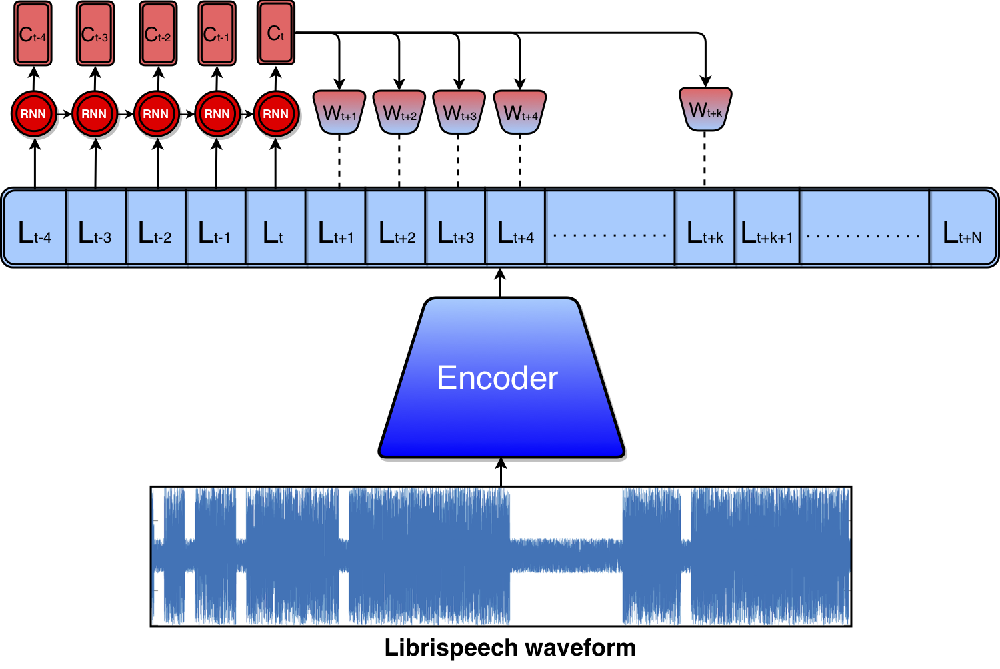
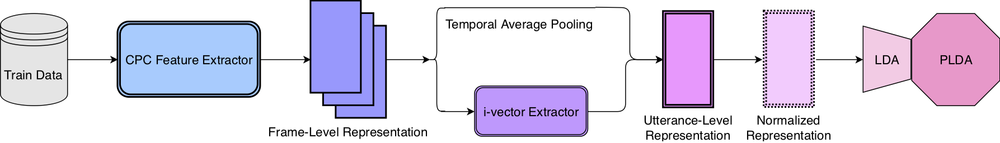
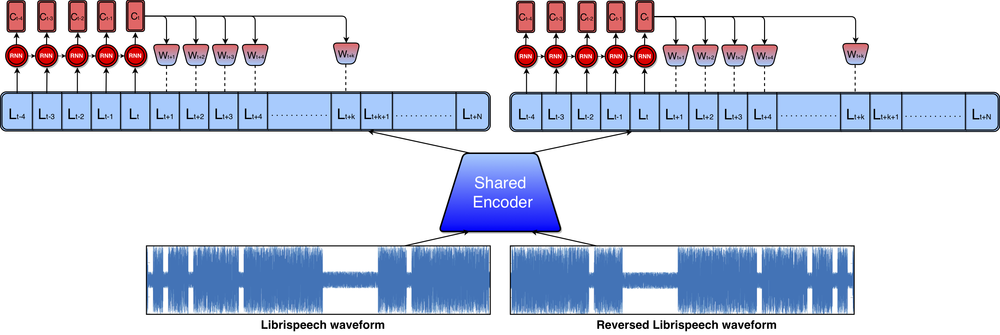
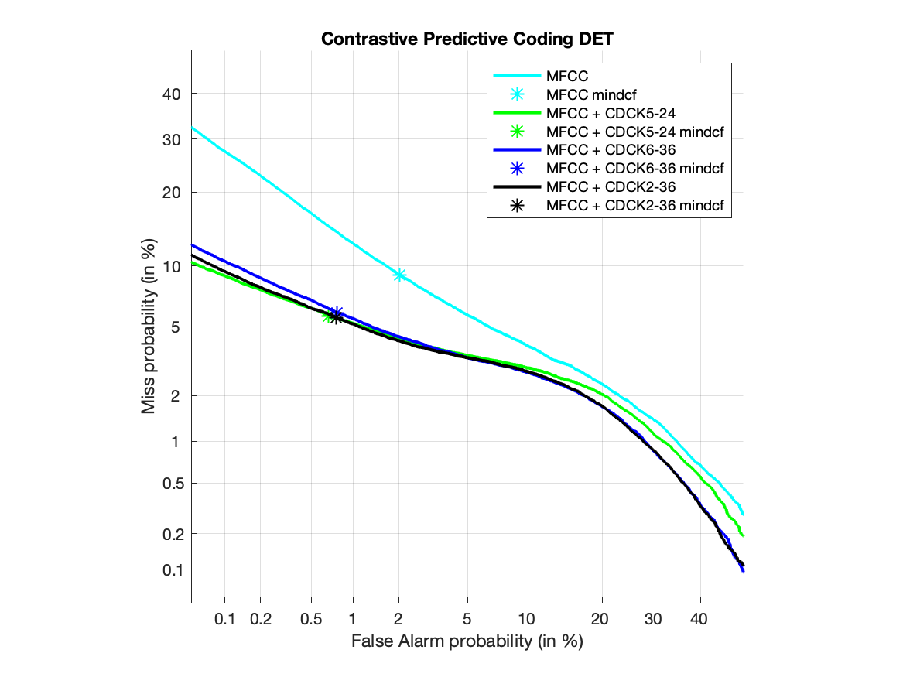
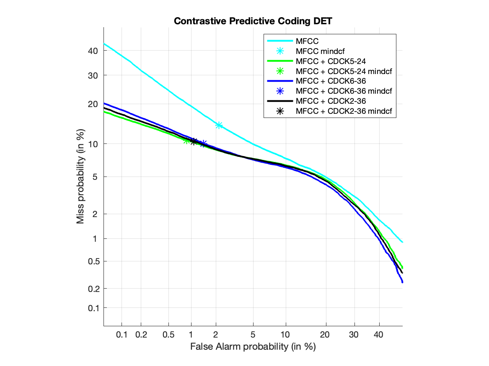

# Contrastive-Predictive-Coding-PyTorch
This repository contains (PyTorch) code to reproduce the core results for: 
* [Representation Learning with Contrastive Predictive Coding](https://arxiv.org/pdf/1807.03748.pdf)
* [Contrastive Predictive Coding Based
Feature for Automatic Speaker Verification](https://arxiv.org/pdf/1904.01575.pdf)

<p align="center">
 
</p>
<p align="center">
 
</p>

# Getting Started
`./src/model/model.py` contains the CPC models implementation, `./src/main.py` is the code for training the CPC models, `./src/spk_class.py` trains a NN speaker classifier, `./ivector/` contains the scripts for running an i-vectors speaker verification system. 

An example of CPC and speaker classifier training can be found at
```
./run.sh
```

## CPC Models
CDCK2: base model from the paper 'Representation Learning with Contrastive Predictive Coding'.  
CDCK5: CDCK2 with a different decoder.  
CDCK6: CDCK2 with a shared encoder and double decoders.  
<p align="center">
 
</p>

# Experimental Results 

## A. CPC Model Training 
|        CPC model ID         | number of epoch |   model size   |  dev NCE loss   |    dev acc.    |  
| :-------------------------: | :-------------: | :------------: | :-------------: | :------------: |
|           CDCK2             |        60       |     7.42M      |      1.6427     |      26.42     |  
|           CDCK5             |        60       |     5.58M      |      1.7818     |      22.48     |
|           CDCK6             |        30       |     7.33M      |      1.6484     |      28.24     |

## B. Speaker Verificaiton on LibriSpeech test-clean-100 (Average Pooling)
Note: [1st trial list](https://drive.google.com/file/d/10h9GH_vi-BRBT_L_xmSM1ZumQ__jRBmx/view) and [2nd trial list](https://drive.google.com/file/d/1FDOU1iNSdGT-IMCQnuuJCWV421168x4H/view)  

|          Feature            |   Feature Dim   |  Summarization  |     LDA Dim     |     1st EER    |    2nd EER     | 
| :-------------------------: | :-------------: | :------------:  | :-------------: | :------------: | :------------: |
|           MFCC              |        24       | average pooling |       24        |      9.211     |     13.48      |
|           CDCK2             |        256      | average pooling |       200       |      5.887     |     11.1       |
|           CDCK5             |        40       | average pooling |       40        |      7.508     |     12.25      |
|           CDCK6             |        256      | average pooling |       200       |      6.809     |     12.73      |

## C. CPC applied with PCA 
|        Feature w PCA        | Original Feature |     PCA Dim    |  PCA Variance Ratio  |
| :-------------------------: | :--------------: | :------------: | :------------------: | 
|          CDCK2-36           |       CDCK2      |       36       |        76.76         |   
|          CDCK2-60           |       CDCK2      |       60       |        87.40         |
|          CDCK5-24           |       CDCK5      |       24       |        93.39         | 

## D. Speaker Verificaiton on LibriSpeech test-clean-100 (i-vectors)
|          Feature            |   Feature Dim   |  Summarization  |    1st EER     |    2nd EER     | 
| :-------------------------: | :-------------: | :------------:  | :------------: | :------------: |
|           MFCC              |       24        |    i-vectors    |     5.518      |     8.157      |
|         CDCK2-60            |       60        |    i-vectors    |     5.351      |     9.753      |
|         CDCK5-24            |       24        |    i-vectors    |     4.911      |     8.901      |
|         CDCK6-60            |       60        |    i-vectors    |     5.228      |     9.009      |
|      MFCC + CDCK2-36        |       60        |    i-vectors    |     3.62       |     6.898      |
|      MFCC + CDCK5-24        |       48        |    i-vectors    |     3.712      |     6.962      |
|      MFCC + CDCK6-36        |       60        |    i-vectors    |     3.691      |     6.765      |

## E. DET Curves of CPC and MFCC Fusion for i-vectors Speaker Verification
<p align="center">
 
</p>
<p align="center">
 
</p>

## Authors 
Cheng-I Lai.

If you encouter any problem, feel free to contact me.
